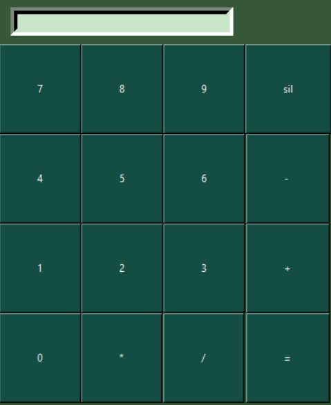

# 🧮 Basit Hesap Makinesi

Bu proje Python ve Tkinter kullanılarak geliştirilmiş basit bir grafik arayüzlü hesap makinesidir. Toplama, çıkarma, çarpma ve bölme işlemlerini destekler.

## 🚀 Özellikler

- Toplama, çıkarma, çarpma, bölme
- Kullanıcı dostu arayüz (Tkinter)
- Hata kontrolü

## 🖼️ Ekran Görüntüsü



## 📦 Kurulum

```bash
pip install -r requirements.txt
